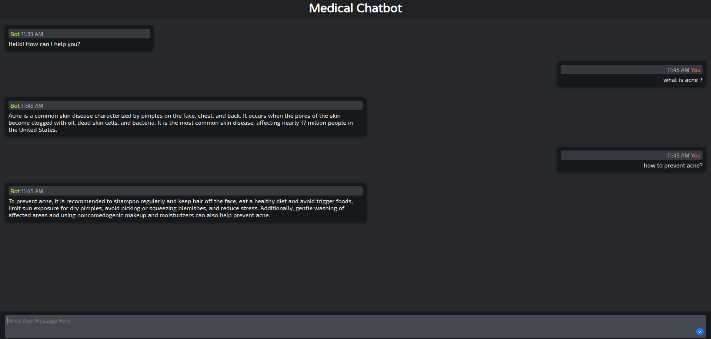

# Medical RAG Chatbot using Flask, Pinecone, and OpenAI  

This project is a **Retrieval-Augmented Generation (RAG) chatbot** designed for medical inquiries, built using **Flask** for the backend, **Pinecone** as the vector database, and **OpenAI's GPT models** for response generation. It allows users to interact with an AI assistant that retrieves relevant medical knowledge before generating responses, enhancing accuracy and reliability.  

## 🚀 Features  
- **Flask Backend** – Handles user interactions and API requests.  
- **Pinecone Vector Database** – Efficiently stores and retrieves medical document embeddings for context-aware responses.  
- **OpenAI API** – Powers chatbot responses with advanced language models.  
- **Medical Knowledge Retrieval** – Ensures responses are backed by relevant medical documents.  
- **Efficient RAG Pipeline** – Combines retrieval and generation for informed and contextually accurate conversations.  

## 🔧 How It Works  
1. **Load Medical Documents** – Ingests and embeds medical text data into Pinecone.  
2. **User Query** – Accepts input through a Flask-based web interface or API endpoint.  
3. **Context Retrieval** – Fetches relevant medical information using Pinecone.  
4. **Response Generation** – Uses OpenAI's model to generate a response based on the retrieved medical context.  

This project is ideal for **medical knowledge retrieval, AI-assisted diagnosis support, and healthcare chat applications.** 🏥🚀  
 

## 🛠 Installation & Setup  
Before running the application, create a `.env` file from `.env.sample` and you will need to set the following environment variables to your .env file `OPENAI_API_KEY` and `PINECONE_API_KEY`

1. Clone the repository:  
   ```bash
   git clone https://github.com/smrussel/medical-chatbot-rag.git
   cd medical-chatbot-rag
    ```
2. Install dependencies:
    ```bash
    pip install -r requirements.txt
    ```
3. Run this command once when you want create pinecone index and load data in pinecone:
    ```bash
    python load_data_vector_data.py
    ```


3. Run the chatbot:
    ```bash
    python app.py
    ```

## 📌 Dependencies
    * Python 3.10
    * Flask
    * Pinecone
    * OpenAI API
    * Langchain 


## Gradio Chabot UI



## 📜 License
This project is licensed under the [MIT](LICENSE) License.